# Near-Real-Time-Gadget-Sales-Analytics

## Project Overview
This project implements a near real-time data pipeline for processing tech gadget sales transactions. It captures real-time changes (CDC) from DynamoDB, processes them using Kinesis and Lambda, and stores the transformed data in S3 for analysis with Athena.

## Tech Stack:
- Python
- AWS DynamoDB
- DynamoDB Streams
- Kinesis Streams
- EventBridge Pipes
- Kinesis Firehose
- AWS S3
- AWS Lambda
- AWS Glue & Athena

## Architecture Overview
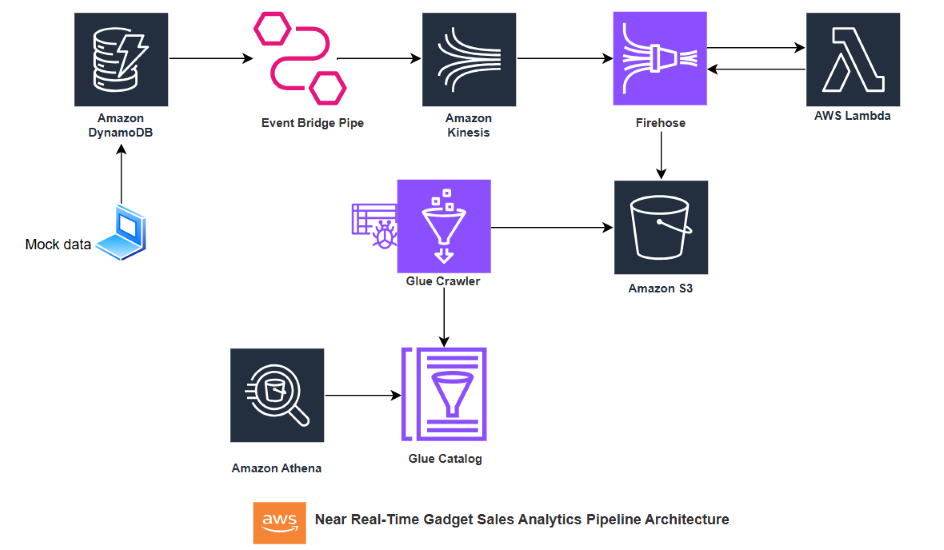

`1. Data Ingestion:`
 - Sales transactions are inserted into DynamoDB (Gadget_Orders table).
 - DynamoDB Streams capture real-time changes (Insert/Update/Delete).

`2. Real-Time Processing:`
 - EventBridge Pipes send CDC events from DynamoDB Streams to Kinesis Streams.
 - Kinesis Firehose processes the streaming data and sends it to S3.
 - A Lambda function performs real-time data transformation before storing it in S3.

`3. Data Storage & Querying:`
 - Transformed data is stored in S3.
 - AWS Glue Crawler scans S3 and creates a table in the Glue Data Catalog.
 - Athena is used for querying and analyzing sales data.

## Execution Steps:

`1. DynamoDB Table Creation`
The Gadget_Orders table is created to store raw sales data.

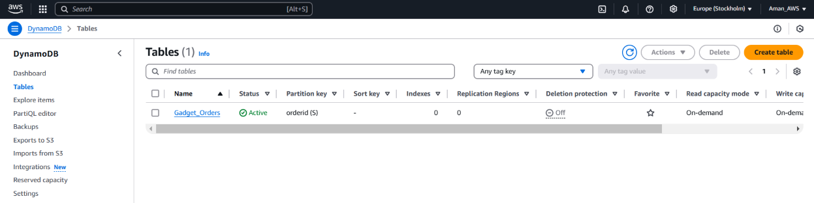

`2. Enabling CDC with DynamoDB Streams`
Streams are enabled to capture real-time changes (Insert/Update/Delete).

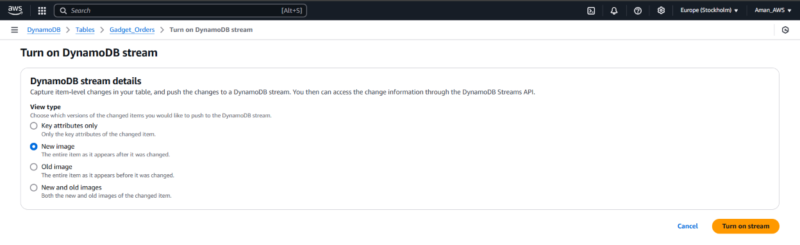

`3. Kinesis Stream Setup`
A Kinesis stream (gadget_sales_cdc) is created to receive CDC events from DynamoDB.

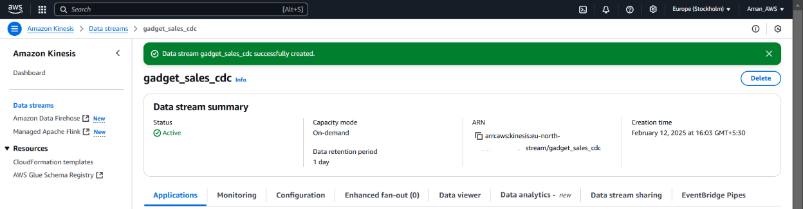

`4. EventBridge Pipe Configuration`
The EventBridge Pipe connects DynamoDB Streams → Kinesis Stream for real-time processing.

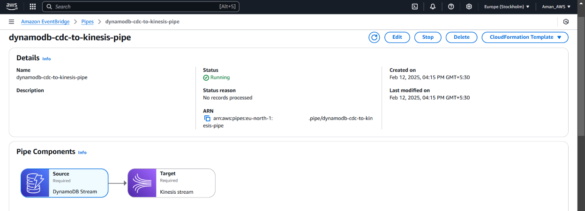

`5. Kinesis Firehose Setup`
A Kinesis Firehose stream (kinesis-gadget-data-s3) delivers data to S3.
A Lambda function is configured for real-time data transformation.

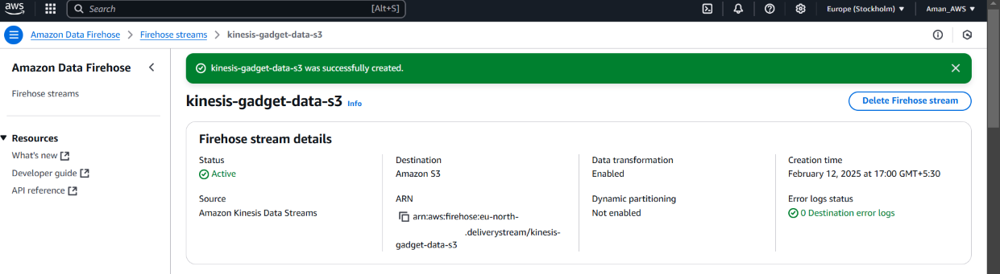

`6. Lambda Function for Data Transformation`
The Lambda function (gadget_sales_transform) processes incoming data before storing it in S3.

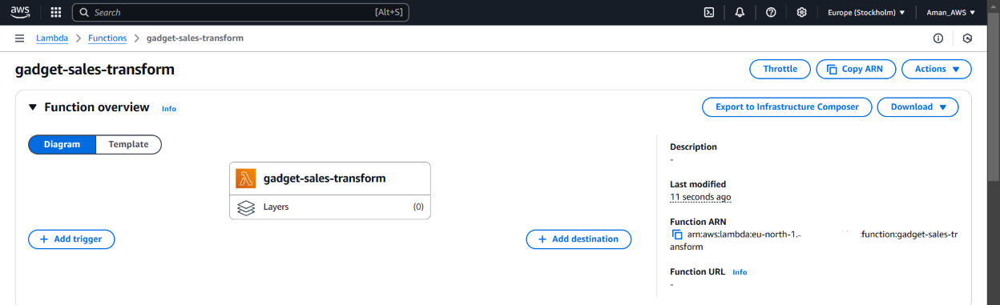

`7. DynamoDB Data Insertion`
Mock sales transactions are inserted into DynamoDB, triggering CDC events.

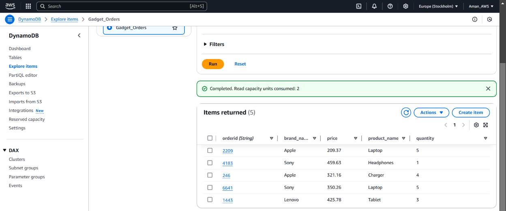

`8. Kinesis Stream Data Arrival`
The Kinesis stream receives real-time data from DynamoDB Streams via EventBridge Pipes.

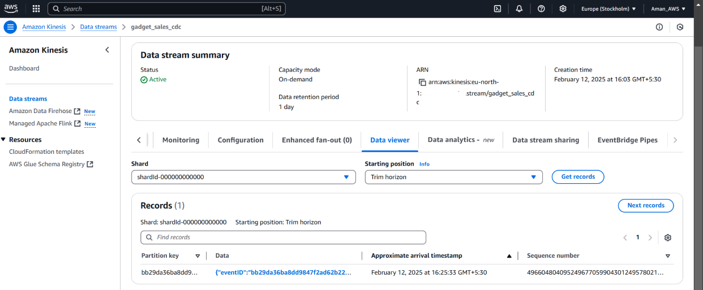

`9. S3 Data Delivery & Transformation`
We see both successfully transformed data (from the Lambda function) and an instance where the transformation failed due to an error in the Lambda function.

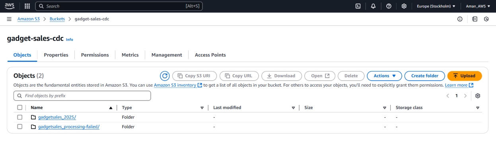

Sample Data in S3: data in the S3 bucket after transformation by the Lambda function. The data is now in the desired format and ready to be queried using Athena.

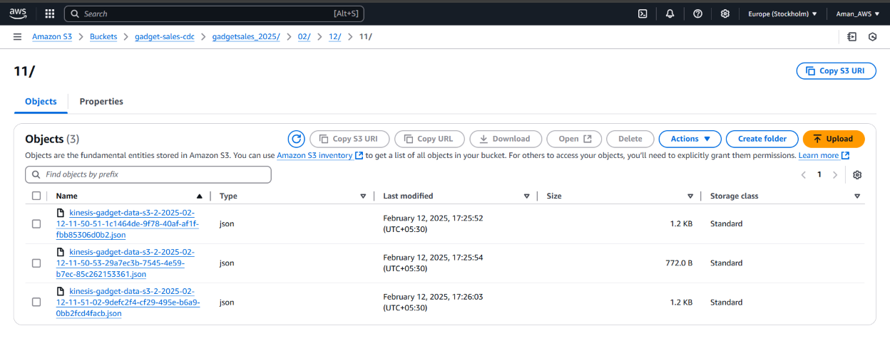
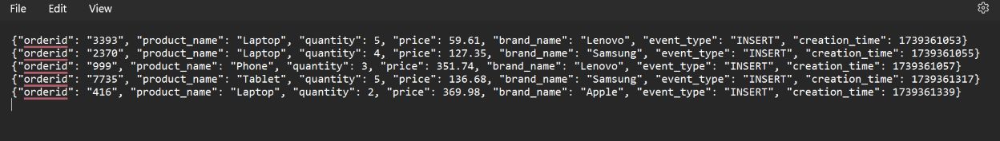

`10. Glue Crawler & Data Catalog Setup`
AWS Glue Crawler scans S3 and registers the schema in Glue Data Catalog.

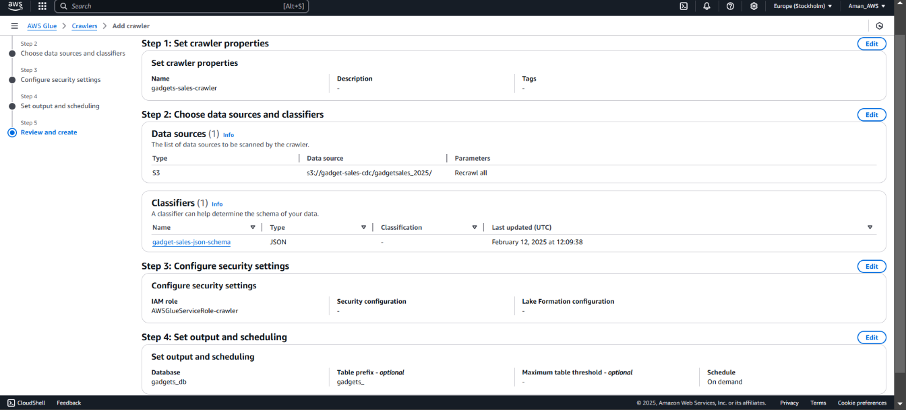

Custom Classifier: This image shows the creation of a custom classifier in Glue.  This classifier is used to define the schema of the data in S3 (in Json format)

`11. Athena Query for Analysis`
Athena is used to query and analyze sales data stored in S3.

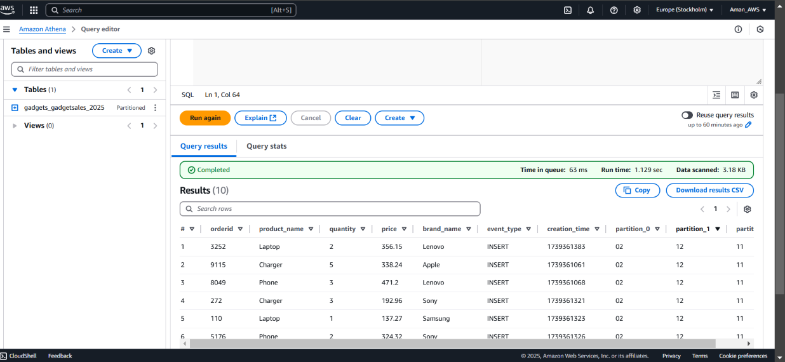

`12. Capturing Data Modifications (CDC in Athena)`

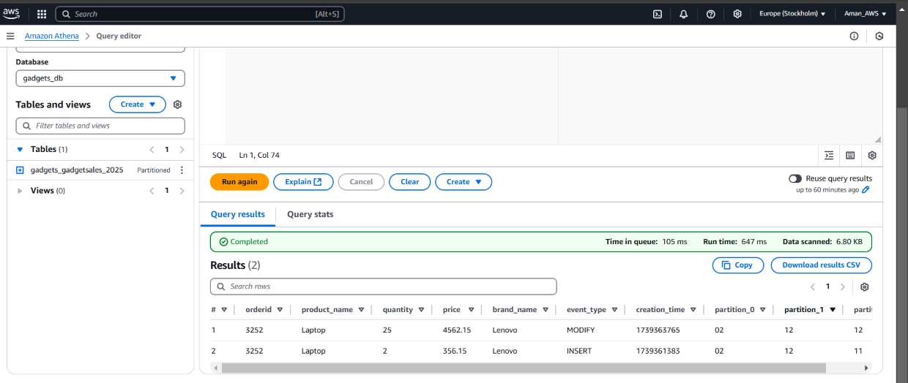

## Key Learnings
- Real-Time Data Processing: Used DynamoDB Streams, Kinesis, and Firehose for near real-time event processing.
- Event-Driven Architecture: Implemented EventBridge Pipes for seamless integration of CDC events.
- Data Transformation & Storage: Leveraged Lambda & S3 for structured data storage and querying.
- Schema Management: Used Glue Crawler to infer schema and enable Athena queries.

## Future Enhancements

- Implement Real-Time Dashboards: Use Amazon QuickSight for interactive visualization of sales

## 👨‍💻 Author
Hi, I’m Aman Saxena!, an aspiring Data Engineer. Feel free to connect on amansaxena129@gmail.com
